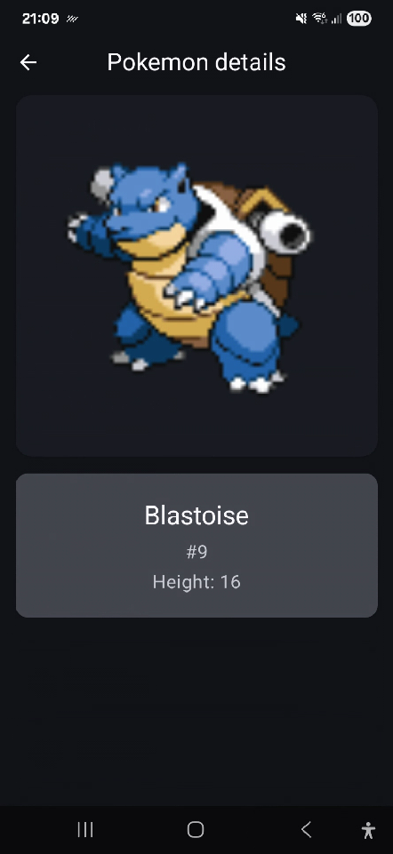

# Pokemon List App

A simple Android app built with Jetpack Compose and MVVM architecture that displays a list of Pokemon from the remote API https://pokeapi.co.
Users can scroll through the Pokemon list, and tap on a Pokemon to view its details.

---

## Features

- Pokemon List Screen  
  Displays Pokemon names in a scrollable list.

- Detail Screen  
  Shows more information about the selected Pokemon.

- Responsive UI  
  Adapts to both light mode and dark mode with proper status bar handling.

---

## Tech Stack

- Language: Kotlin
- UI: Jetpack Compose
- Architecture: MVVM
- Dependency Injection: Hilt
- Networking: Retrofit
- Async/Coroutines: Kotlin Coroutines + Flow
- Theming: Material 3 + Dynamic light/dark theme
- Test libraries: JUnit, Mockito, Turbine and Jetpack Compose UI Test for instrumentation

---

## Project Structure

- Presentation Layer  
  Contains the UI (Jetpack Compose) and ViewModels. It observes state and renders it on screen.

- Domain Layer  
  Holds the business logic, including use cases and domain models. Keeps the app independent of frameworks.

- Data Layer  
  Handles API calls and repository implementations. Responsible for mapping remote data into domain models.

This structure ensures scalability, readability, and easier testing.

---

## Design Decisions

- The app was built with scalability in mind, the endpoint used returns the list of Pokemon in pages of 20 items each.
- Coil was chosen because it integrates well with Jetpack Compose and is efficient for remote images.

| Pokemon List                  | Details                             | Error                           |
|-------------------------------|-------------------------------------|---------------------------------|
|  |  |  |